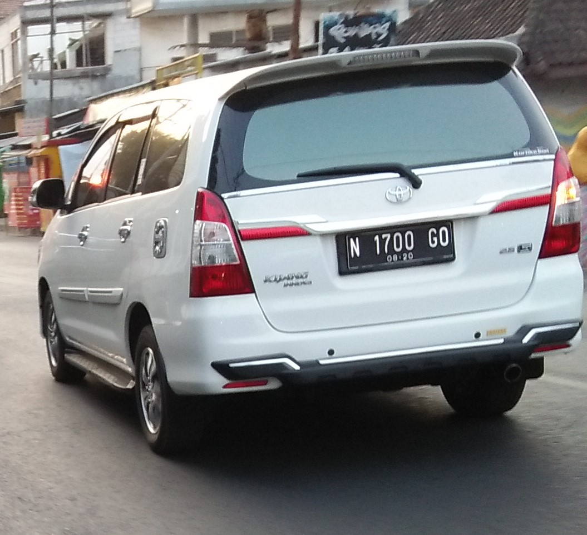
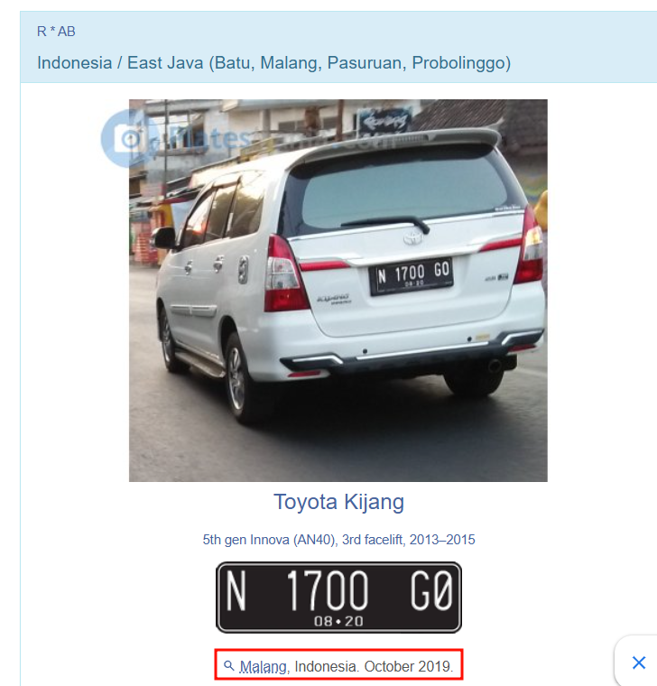
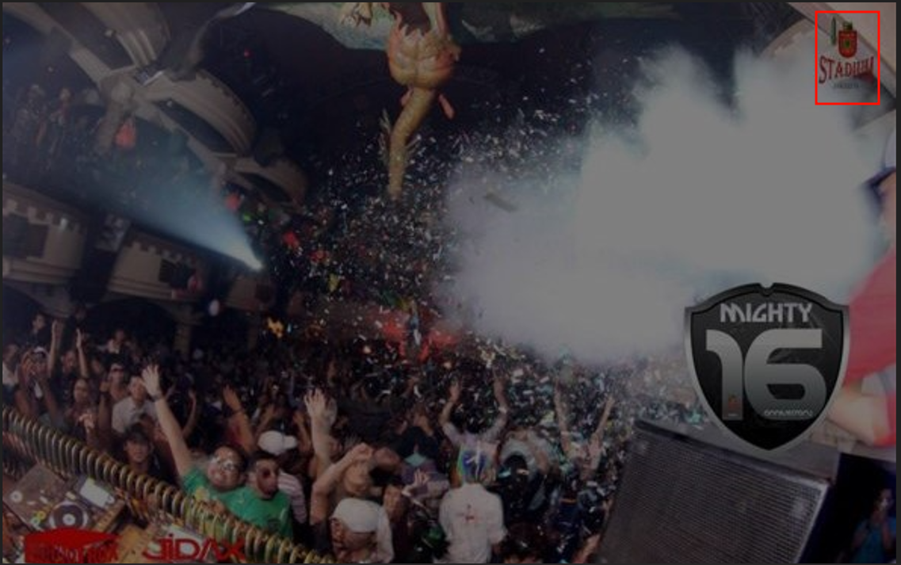
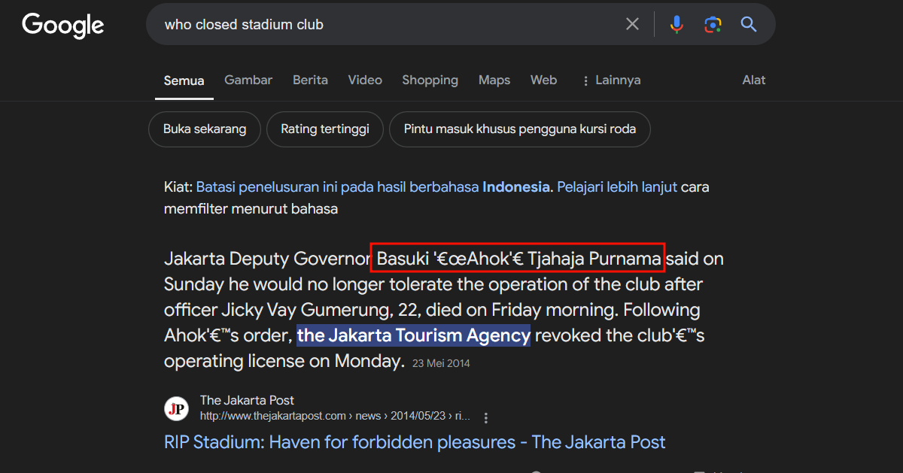
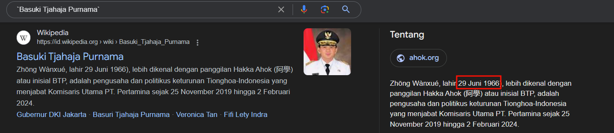
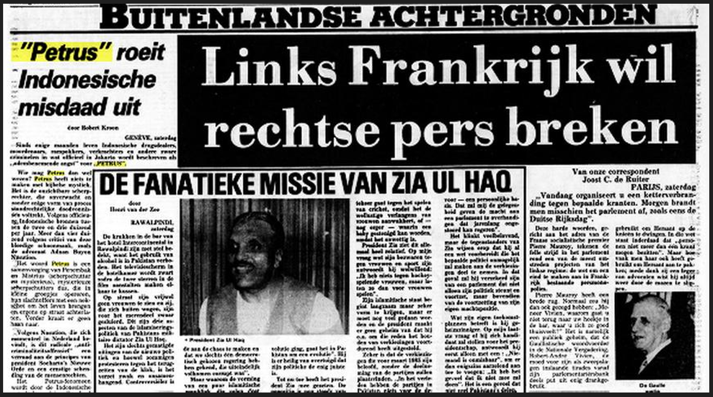
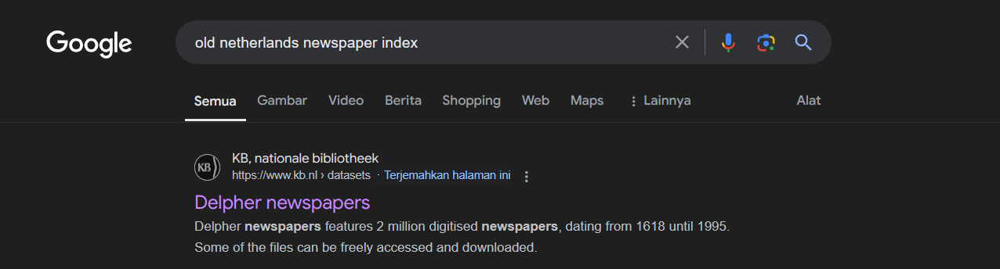
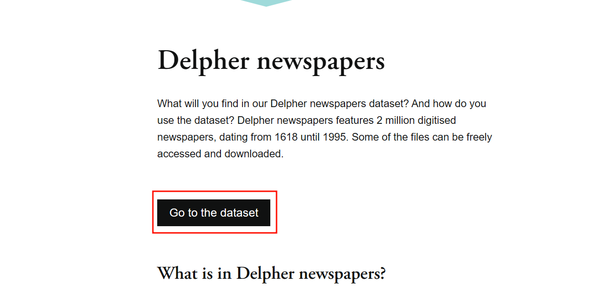
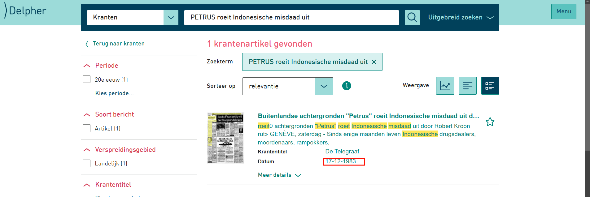

# OSINT

Here's my writeup for 5 out of 7 solved challenge.

## Bandit

>Author: **Jieyab89**
>An Jieyab as informant took a photo of a vehicle, can you find the location?

The flag is name the location and date example TCP1P{Town, Coutry. Month Year}

### Solution

Searching with google lens will showing a [website](https://platesmania.com/id/nomer24795105) for plate that contain the details

The flag `TCP1P{Malang, Indonesia. October 2019}`

## Night Live at Indonesia

> Author: **Jieyab89**
> Oeman is a nightlife maniac tourist in 2007 - 2010, he came back to Indonesia to enjoy the nightlife but the place was closed, what was the name of the place? And who was the person who closed the place?

The flag is name of Man was close the place and the birth date example TCP1P{Abdul Risna Ardana, 14 July 1669}

### Solution

Upon opening the attachment.zip, the zip contain photo from nightclub. One of the photos contain a watermark for famous nightclub at that time **STADIUM**

Searching up for who closed the place is easy, because it's a big news at that time. The answer will be `Basuki Tjahaja Purnama`

Another google times for `Basuki Tjahaja Purnama` shows his details

The flag `TCP1P{Basuki Tjahaja Purnama, 29 June 1966}`

## The Investigator

>Author: **Jieyab89**
>Help Jieyab found the newspaper. When was this newspaper published?

The flag name is date TCP1P{Date Month Year}

### Solution

Looking at the newspaper seems like a old Dutch newspaper. Looking for old netherlands newspaper index shows this [website](https://www.kb.nl/en/research-find/datasets/delpher-newspapers)

Opening the website will bring us to another data site

Searching the keyword `PETRUS roeit Indonesische misdaad uit` will shows one result with published date `17 December 1983`

The flag is `TCP1P{17 December 1983}`

## The Pentagon

> Author: **thelolna15**
> A few days ago, I saw a funny post on a social media platform. As far as I remember, there are five accounts that frequently post funny and random content.
> I only remember two names: Udin Kurniawan Jaeger and Paijo Abdul Uchiha. I recall that one of them uses a fake account. The humor in his posts is quite random, and I like it.
> I want to know the real name of the person using that second account because I want to connect with him on his main account. Please help me find his full real name.

The flag is the full name

### Solution

