# TCP1P CTF 2024 - OSINT

Here's my writeup for 5 out of 7 solved challenge.

## Bandit

>Author: **Jieyab89**  
>An Jieyab as informant took a photo of a vehicle, can you find the location?

The flag is name the location and date example TCP1P{Town, Coutry. Month Year}

### Solution

Searching with google lens will showing a [website](https://platesmania.com/id/nomer24795105) for plate that contain the details

The flag `TCP1P{Malang, Indonesia. October 2019}`

## Night Live at Indonesia

> Author: **Jieyab89**  
> Oeman is a nightlife maniac tourist in 2007 - 2010, he came back to Indonesia to enjoy the nightlife but the place was closed, what was the name of the place? And who was the person who closed the place?

The flag is name of Man was close the place and the birth date example TCP1P{Abdul Risna Ardana, 14 July 1669}

### Solution

Upon opening the attachment.zip, the zip contain photo from nightclub. One of the photos contain a watermark for famous nightclub at that time **STADIUM**

Searching up for who closed the place is easy, because it's a big news at that time. The answer will be `Basuki Tjahaja Purnama`

Another google times for `Basuki Tjahaja Purnama` shows his details

The flag `TCP1P{Basuki Tjahaja Purnama, 29 June 1966}`

## The Investigator

>Author: **Jieyab89**  
>Help Jieyab found the newspaper. When was this newspaper published?

The flag name is date TCP1P{Date Month Year}

### Solution

Looking at the newspaper seems like a old Dutch newspaper. Looking for old netherlands newspaper index shows this [website](https://www.kb.nl/en/research-find/datasets/delpher-newspapers)

Opening the website will bring us to another data site

Searching the keyword `PETRUS roeit Indonesische misdaad uit` will shows one result with published date `17 December 1983`

The flag is `TCP1P{17 December 1983}`

## The Pentagon

> Author: **thelolna15**  
> A few days ago, I saw a funny post on a social media platform. As far as I remember, there are five accounts that frequently post funny and random content.  
> I only remember two names: Udin Kurniawan Jaeger and Paijo Abdul Uchiha. I recall that one of them uses a fake account. The humor in his posts is quite random, and I like it.  
> I want to know the real name of the person using that second account because I want to connect with him on his main account. Please help me find his full real name.

The flag is the full name

### Solution

Based on the challenge description,  **Udin Kurniawan Jaeger** and **Paijo Abdul Uchiha**, if I search with google will show result for **paij0uch1h4** on reddit and **ud1nwanj4eger** *(appear when the CTF still ongoing, but disappear when the CTF ends)*
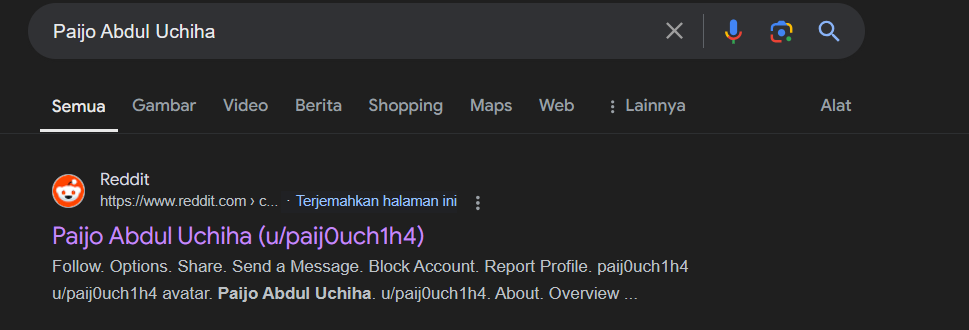

But checking the profile **paij0uch1h4** will show an error `This account has been suspended`, same result also happen with **ud1nwanj4eger**

Searching a way for see the archive for suspended reddit account, bring me to https://ihsoyct.github.io/index.html 
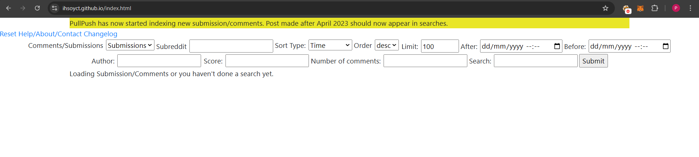

Now searching for both of username founded will only show one post from **ud1nwanj4eger**

Then searching for the title on google will shows the subreddit

Again checking the subreddit will not work, because it's already banned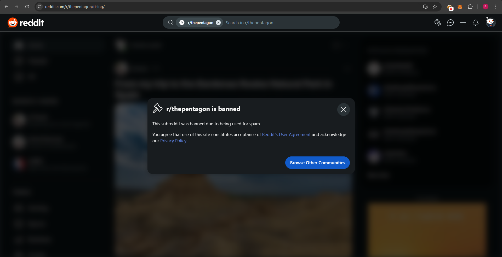

Now back to https://ihsoyct.github.io/index.html , I searched for the subreddit name and it's give one more name **pa1m3nbudg4r**, will note that name also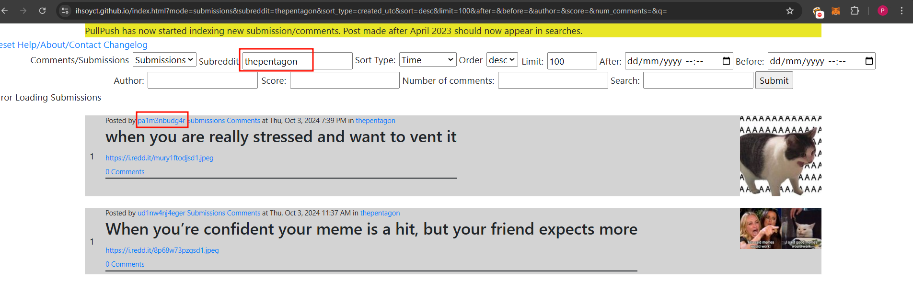

So far i have the following username:
- paij0uch1h4
- ud1nwanj4eger
- pa1m3nbudg4r

I tried to search more interaction between the user on reddit but it's a dead end, and I decided to give it a try a tool called [sherlock](https://github.com/sherlock-project/sherlock). 
[sherlock](https://github.com/sherlock-project/sherlock) are python based tool that works to hunt down social media accounts by username across social networks.

Now runing [sherlock](https://github.com/sherlock-project/sherlock)for all username will give list of results
- paij0uch1h4

- ud1nwanj4eger

- pa1m3nbudg4r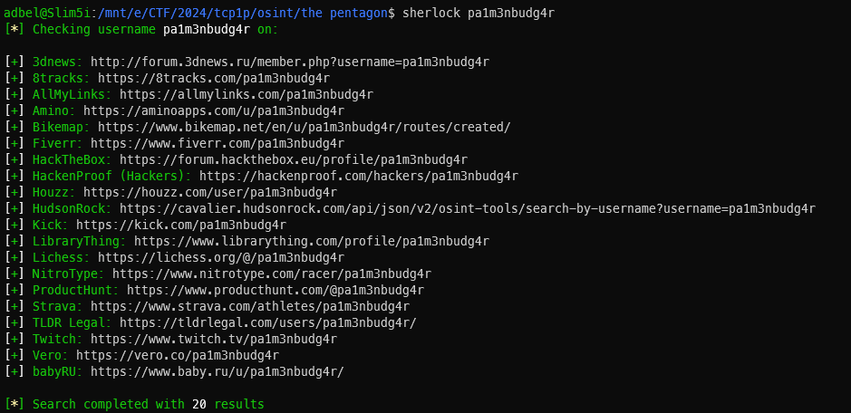

Note that all of the result doesn't always a valid one, so checking one by one if the account existed in the platform still need to be done. And refer back to the post from reddit, my assumption the suspected user is like to post a meme. Consider a platform to post a meme lead me to check from **9gag** for **paij0uch14** and **ud1nwanj4eger** only.

First for **paij0uch14**, seems we're on the right path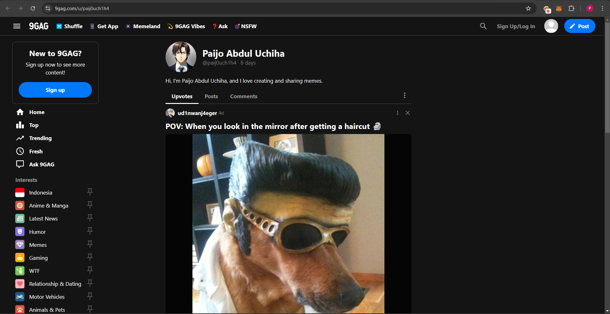

Now for **ud1nwanj4eger** also give some result

Now after checking around the post for both account, I found one post that having 14 comments and 4 upvote from **ud1nwanj4eger**

Checking the comments show another username, **s1k3nts0**. **s1k3nts0** also commented to check funny post from the app with the photo logo and also a post ID `DAJjWLRzVpw` . I'm thinking for **Instagram**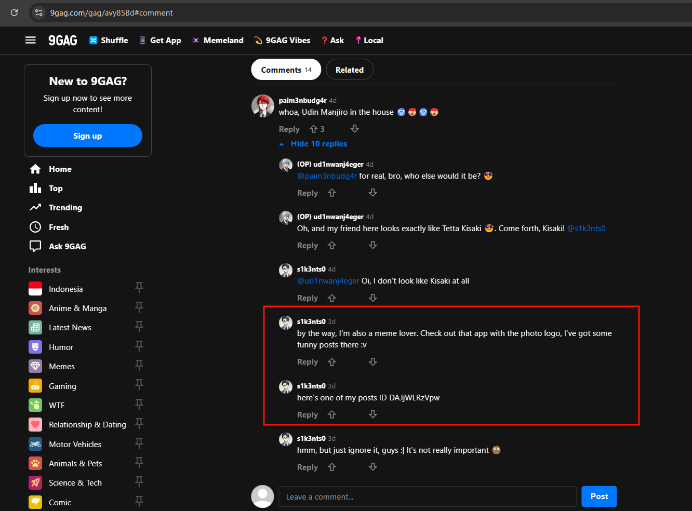

Now to use this post ID on Instagram without login, I need to find a random post then replace the post ID with `DAJjWLRzVpw`. For example here's the post from Zuck

Then replace the post ID to `DAJjWLRzVpw` will redirect to another post from **xalamenderk3nts0**

Checking the Instagram profiles shows a Discord Server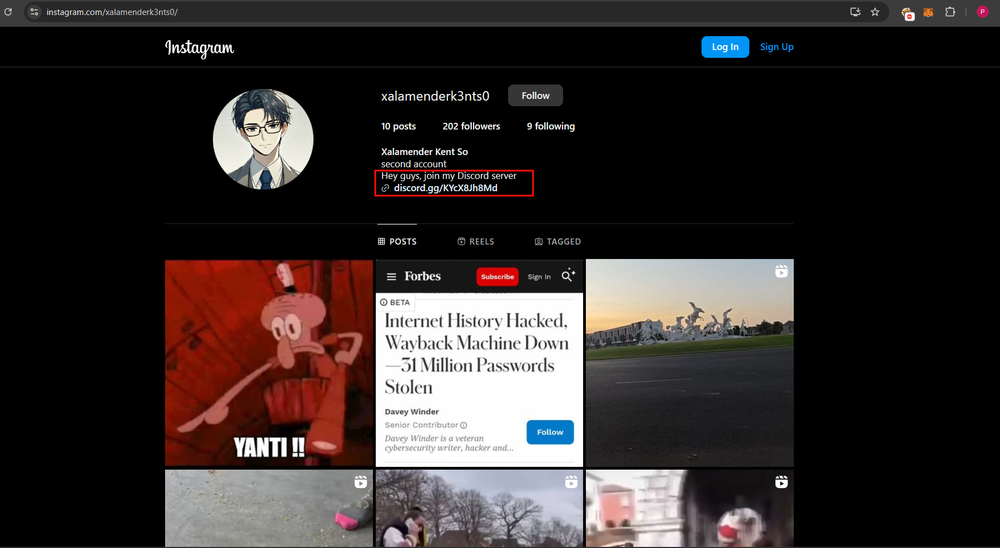

Joining the Discord Server will shows a bot called **xalamenderk3nst0**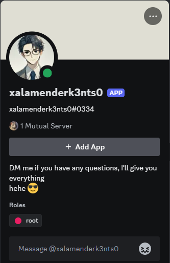

I tried to chat with the bot but it's keep asking about a secret key and inform a hint _find the secret key in a post!_

Looking back to the Instagram account, there's one reels post that have a weird sound at the end of the reels

The sounds is very weird and it's like spells backwards / reverse. Because of that I decide to download the reels audio only using this [site](https://reelsave.app/audio) then open with [Audacity](https://www.audacityteam.org/) to manipulate the audio.

Using Audacity I can see the weird sound looks like at timestamp 0:38 - 0:46
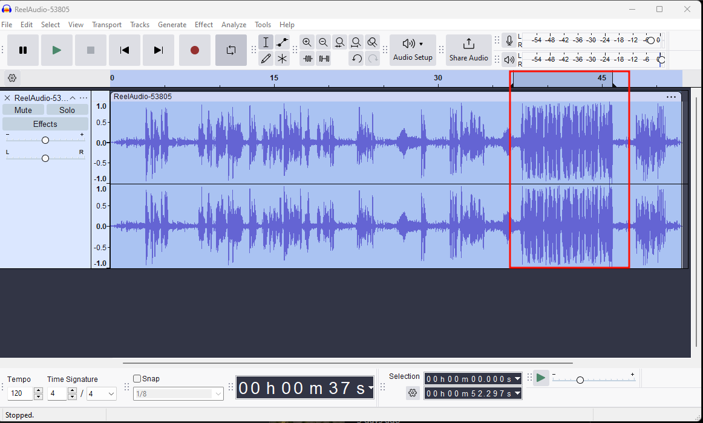

Then I tried to reverse the sound by choosing `Effect -> Special -> Reverse` and try to play again multiple times. Finally from the audio I can get the key which is `TCP1P_TH3P3NT490N_1S4W3S0M3`

After that I send the key to the Discord Bot, the Discord Bot replied with a youtube video link

Clicking the link will pop up a **Rick Astley** video :angry: a channel called **Slamet Uzumaki**

And checking for the channel username will give us **SlametSetiawanUzumaki** 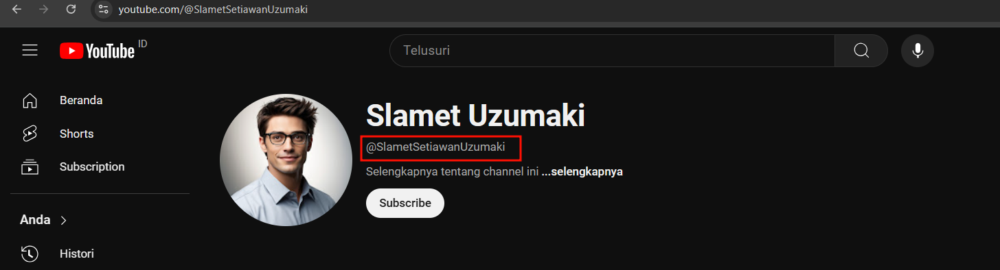

So the flag is `TCP1P{Slamet Setiawan Uzumaki} `

## Lost Younger Sister

>Author: **Jieyab89**
>Help Jieyab find Violet, please read the attachment

The flag is is name of the bus stop in the photo

### Solution

Checking the attachment.zip will show the following

Then I extracted all the files read the `Lost sister.pdf`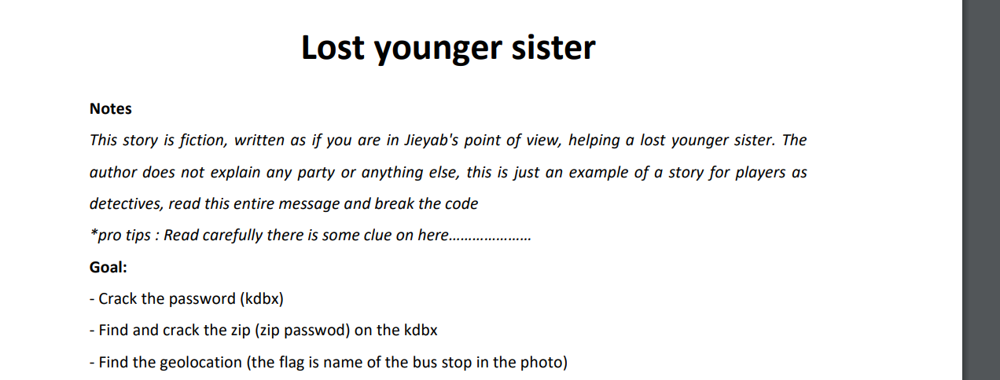

From the first section, there's a `*pro tips: Read carefully there is some clue on here........` and also the goals needed for helping Jieyab to find Violet:
- Crack the password (kbdx)
- Find and crack the zip (zip password) on the kdbx
- Find the geolocation (the flag is name of the bus stop in the photo)

Based from the goals, first I do the crack the password from kdbx, doing this with **keepass2john** to copy the hash from kdbx file doesn't work

The error `! .\Violet Password Manager.kdbx : File version '40000' is currently not supported!` says that this is KDBX version 4 which currently **keepass2john** can't read the format. And assuming from this output, I read again the pdf and refer back `*pro tips: Read carefully there is some clue on here........` so maybe there's something I can use for password here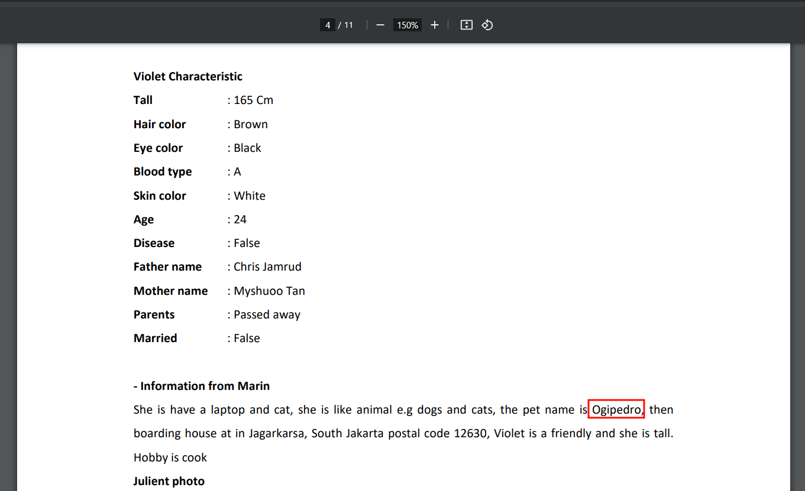

After reading the pdf, Violet have a pet named `Ogipedro` and tried this as the password for kdbx file is worked!

And from the kdbx, there's also a icloud password when copied will shows `Ogipedro10022001` as the password. Now it's time to open the `icloud backup.zip` using this password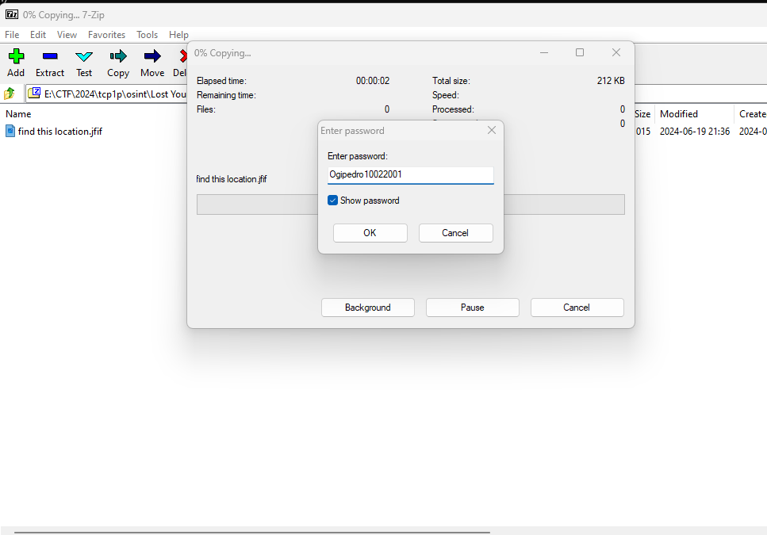

The zip file contain `find this location.jfif`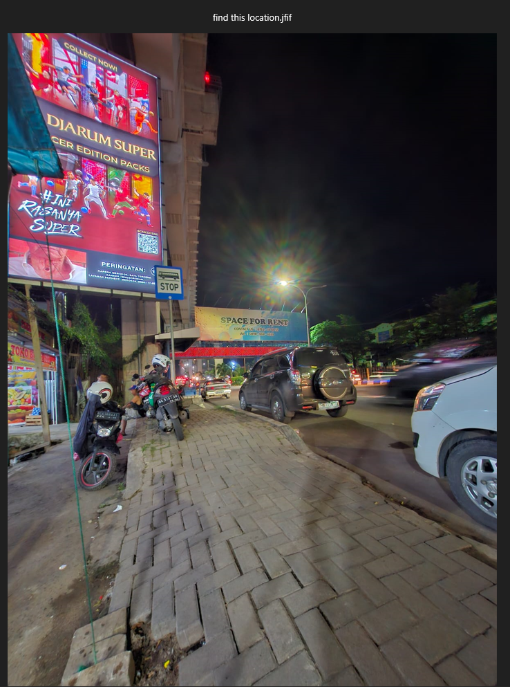

Looking at the objects from the photo i can safely assume the location is Palembang, South Sumatera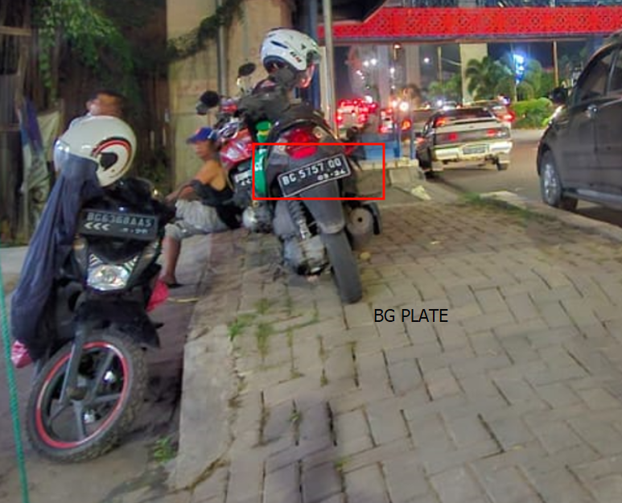

Because the all vehicle plate starts with `BG`

Then from the photo also give another information such as:
1. The bridge above seems like `LRT` rails, I know that `Palembang` city have LRT
2. A cross bridge and billboard
3. There's a fruit shop but I can't read the completed name
4. Also the bus stop sign, the name this bus stop are the flag

Okay let's search the location base from the information above. Searching for the LRT rails will give us this rail path

Now after searching for a while for specific clue, I found the exact location from the photo after passing `Stasiun LRT Garuda Dempo` and this are the google maps link https://maps.app.goo.gl/gw2tb3m9TZs7puHf9 

Looking around for the bus stop name will show `JPO SMP MUHAMMADIYAH 10 B`

But this is not the correct flag, and looking around for another bus stop I found `HALTE JPO SMP MUHAMMADIYAH 10 A` then trying to submit this as the flag will worked!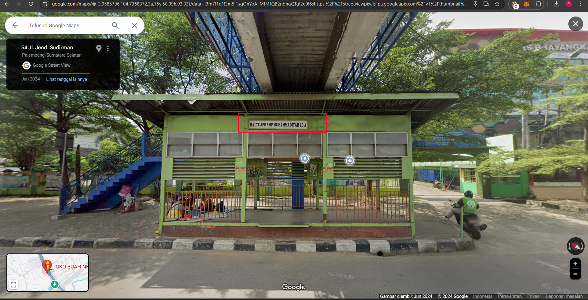

So the flag is `TCP1P{HALTE JPO SMP MUHAMMADIYAH 10 A}`

## Closing

That's from me, really enjoyed this OSINT challenge. Kudos to TC1P and all the authors for making this CTF happen!