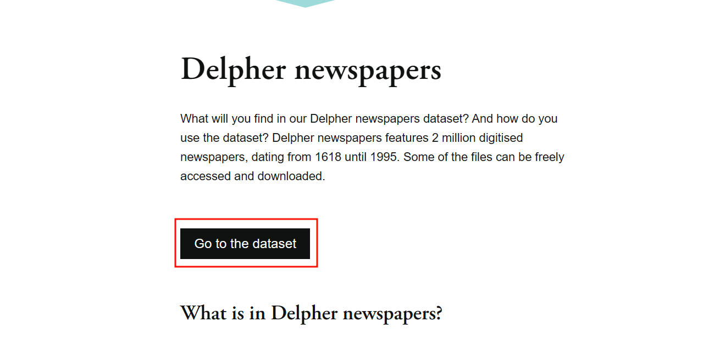
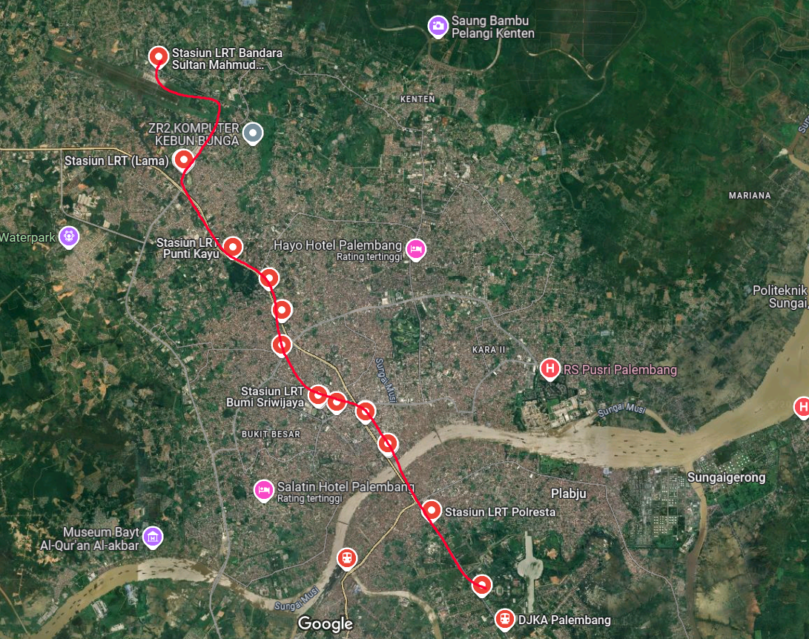

# TCP1P CTF 2024 - OSINT [IDN]

Ini adalah writeup untuk kategori OSINT, tim saya berhasil menyelesaikan 5 dari 7 *challenges* yang ada 

## Bandit

>Author: **Jieyab89**  
>An Jieyab as informant took a photo of a vehicle, can you find the location?

The flag is name the location and date example TCP1P{Town, Coutry. Month Year}

### Solution

Pencarian dengan Google lens akan menampilkan [situs web](https://platesmania.com/id/nomer24795105) untuk plat yang berisi detailnya

Sehingga flagnya adalah `TCP1P{Malang, Indonesia. October 2019}`

## Night Live at Indonesia

> Author: **Jieyab89**  
> Oeman is a nightlife maniac tourist in 2007 - 2010, he came back to Indonesia to enjoy the nightlife but the place was closed, what was the name of the place? And who was the person who closed the place?

The flag is name of Man was close the place and the birth date example TCP1P{Abdul Risna Ardana, 14 July 1669}

### Solution

Saat membuka lampiran.zip, zip tersebut berisi foto dari klub malam. Salah satu foto berisi *watermark* untuk klub malam terkenal saat itu **STADIUM**

Mencari siapa yang menutup tempat itu mudah, karena klub malam **STADIUM** adalah berita besar saat itu. Jawabannya adalah `Basuki Tjahaja Purnama`

Meggunakan google untuk mencari tentang `Basuki Tjahaja Purnama` menunjukan tanggal lahirnya

Sehingga flagnya adalah `TCP1P{Basuki Tjahaja Purnama, 29 June 1966}`

## The Investigator

>Author: **Jieyab89**  
>Help Jieyab found the newspaper. When was this newspaper published?

The flag name is date TCP1P{Date Month Year}

### Solution

Jika melihat koran tersebut, sepertinya koran Belanda dari tahun lampau. Mencari indeks koran Belanda lama pada Google akan menampilkan [situs web](https://www.kb.nl/en/research-find/datasets/delpher-newspapers) ini

Membuka situs web akan membawa kita ke situs data lainnya

Pencarian kata kunci `PETRUS roeit Indonesische misdaad uit` akan menghasilkan satu hasil dengan tanggal terbit `17 December 1983`

Sehingga flagnya adalah `TCP1P{17 December 1983}`

## The Pentagon

> Author: **thelolna15**  
> A few days ago, I saw a funny post on a social media platform. As far as I remember, there are five accounts that frequently post funny and random content.  
> I only remember two names: Udin Kurniawan Jaeger and Paijo Abdul Uchiha. I recall that one of them uses a fake account. The humor in his posts is quite random, and I like it.  
> I want to know the real name of the person using that second account because I want to connect with him on his main account. Please help me find his full real name.

The flag is the full name

### Solution

Berdasarkan deskripsi tantangan, **Udin Kurniawan Jaeger** dan **Paijo Abdul Uchiha**, jika saya mencari dengan Google, akan muncul hasil untuk **paij0uch1h4** di Reddit dan **ud1nwanj4eger** *(namun ini hanya muncul saat CTF masih berlangsung dan menghilang saat CTF berakhir)*

Namun saat memeriksa profil **paij0uch1h4** akan menampilkan *error* `Akun ini telah ditangguhkan`, hasil yang sama juga terjadi dengan **ud1nwanj4eger**

Mencari cara untuk melihat arsip akun Reddit yang ditangguhkan, membawa saya ke https://ihsoyct.github.io/index.html

Sekarang pencarian kedua nama pengguna yang ditemukan hanya akan menampilkan satu posting dari **ud1nwanj4eger**

Kemudian mencari judul dari post reddit tersebut di Google akan menampilkan subreddit berikut

Sekali lagi, memeriksa subreddit tidak akan berhasil, karena sudah diblokir

Sekarang kembali ke https://ihsoyct.github.io/index.html, saya mencari nama subreddit dan hasilnya akan menampilkan satu nama lagi yaitu **pa1m3nbudg4r**, tentunya saya akan catat ini

Sejauh ini saya memiliki *username* berikut:
- paij0uch1h4
- ud1nwanj4eger
- pa1m3nbudg4r

Saya mencoba mencari lebih banyak interaksi antar pengguna di Reddit tetapi tidak ada hasil, dan saya memutuskan untuk mencoba alat yang disebut [sherlock](https://github.com/sherlock-project/sherlock).
[sherlock](https://github.com/sherlock-project/sherlock) adalah alat berbasis python yang berfungsi untuk memburu akun media sosial berdasarkan nama pengguna di seluruh jaringan sosial.

Sekarang menjalankan [sherlock](https://github.com/sherlock-project/sherlock)untuk semua nama pengguna akan memberikan daftar hasil
- paij0uch1h4

- ud1nwanj4eger

- pa1m3nbudg4r

Perhatikan bahwa semua hasil tidak selalu valid, jadi pengecekan satu per satu apakah akun tersebut ada di platform tersebut masih perlu dilakukan. Dan merujuk kembali ke postingan dari reddit, asumsi saya pengguna yang dicurigai itu suka memposting meme. Pertimbangkan platform untuk memposting meme yang membuat saya memeriksa dari **9gag** untuk **paij0uch14** dan **ud1nwanj4eger** saja.

Pertama untuk **paij0uch14**, tampaknya kita di jalan yang benar!

Sekarang untuk **ud1nwanj4eger** juga memberikan beberapa hasil

Sekarang setelah memeriksa postingan kedua akun tersebut, saya menemukan satu postingan yang memiliki 14 komentar dan 4 upvote dari **ud1nwanj4eger**

Memeriksa komentar akan menunjukan ada nama pengguna lain, **s1k3nts0**. **s1k3nts0** juga berkomentar untuk memeriksa kiriman lucu dari aplikasi dengan logo foto dan juga ID kiriman `DAJjWLRzVpw`. Saya langsung mengira bahwa aplikasi yang dimaksud adalah **Instagram**

Sekarang untuk menggunakan ID postingan ini di Instagram tanpa login, saya perlu menemukan postingan acak lalu mengganti ID postingan dengan `DAJjWLRzVpw`. Misalnya, berikut postingan dari Zuck

Kemudian ganti ID posting ke `DAJjWLRzVpw` akan mengarahkan kita ke posting lain yaitu milik **xalamenderk3nts0**

Memeriksa profil Instagram menunjukkan Server Discord

Bergabung dengan Server Discord akan menampilkan bot bernama **xalamenderk3nst0**

Saya coba mengobrol dengan bot tersebut namun ia terus menanyakan kunci rahasia dan memberi petunjuk _temukan kunci rahasia dalam sebuah postingan!_

Melihat kembali ke akun Instagram, ada satu kiriman reel yang memiliki suara aneh di akhir reel

Suaranya sangat aneh dan seperti ejaan terbalik. Karena itu saya memutuskan untuk mengunduh audio reels hanya menggunakan [situs](https://reelsave.app/audio) ini lalu membukanya dengan [Audacity](https://www.audacityteam.org/) untuk memanipulasi audionya.

Menggunakan Audacity saya dapat melihat suara aneh seperti pada *timestamp* 0:38 - 0:46

Kemudian saya coba membalikkan suara dengan memilih `Effect -> Special -> Reverse` dan coba memutar lagi beberapa kali. Akhirnya dari audio saya bisa mendapatkan kunci rahasia yaitu `TCP1P_TH3P3NT490N_1S4W3S0M3`

Setelah itu saya kirim kunci tersebut ke Bot Discord, Bot Discord membalas dengan link video youtube

Mengklik tautan tersebut akan memunculkan video **Rick Astley** :((((((((( dan saluran bernama **Slamet Uzumaki**

Dan memeriksa nama pengguna saluran akan memberikan kita **SlametSetiawanUzumaki** 

Sehingga flagnya adalah `TCP1P{Slamet Setiawan Uzumaki} `

## Lost Younger Sister

>Author: **Jieyab89**
>Help Jieyab find Violet, please read the attachment

The flag is is name of the bus stop in the photo

### Solution

Memeriksa attachment.zip akan menampilkan yang berikut ini

Kemudian saya mengekstrak semua file dan membaca `Lost sister.pdf`

Dari bagian pertama, ada `*tips pro: Baca dengan saksama, ada beberapa petunjuk di sini........` dan juga tujuan yang dibutuhkan untuk membantu Jieyab menemukan Violet:
- Pecahkan kata sandi (kbdx)
- Temukan dan pecahkan kode pos (kata sandi zip) di kdbx
- Temukan geolokasi (bendera adalah nama halte bus di foto)

Berdasarkan *goals*, pertama saya melakukan crack password dari kdbx, saya melakukan ini dengan **keepass2john** untuk menyalin hash dari file kdbx namun tidak berhasil

Error `! .\Violet Password Manager.kdbx : Versi file '40000' saat ini tidak didukung!` mengatakan bahwa ini adalah KDBX versi 4 yang saat ini **keepass2john** tidak dapat membaca formatnya. Dan dengan asumsi dari *error* ini, saya membaca lagi pdf serta merujuk kembali pada `*tips pro: Baca dengan saksama ada beberapa petunjuk di sini........` jadi mungkin ada sesuatu yang dapat saya gunakan untuk kata sandi di sini

Setelah membaca pdf kembali, Violet memiliki hewan peliharaan bernama `Ogipedro` dan mencoba ini sebagai kata sandi untuk file kdbx ternyata berhasil!

Dan dari kdbx, ada juga kata sandi icloud ketika disalin akan menunjukkan `Ogipedro10022001` sebagai kata sandinya. Sekarang saatnya membuka `icloud backup.zip` menggunakan kata sandi ini

File zip berisi `temukan lokasi ini.jfif`

Melihat objek pada foto tersebut saya dapat dengan yakin berasumsi lokasinya adalah Palembang, Sumatera Selatan

Karena semua plat kendaraan dimulai dengan `BG`

Kemudian dari foto tersebut juga memberikan informasi lain seperti:
1. Jembatan di atas terlihat seperti rel LRT, saya tahu kalau di kota Palembang ada LRT
2. Sebuah jembatan penyeberangan dan papan reklame
3. Ada toko buah tapi saya tidak bisa membaca nama lengkapnya
4. Juga rambu halte bus, nama halte bus ini adalah flag nya

Oke mari kita cari lokasi berdasarkan informasi di atas. Mencari rel LRT akan memberi kita jalur rel ini

Sekarang setelah mencari beberapa lama untuk petunjuk spesifik, saya menemukan lokasi yang tepat dari foto setelah melewati `Stasiun LRT Garuda Dempo` dan ini adalah gmaps linknya https://maps.app.goo.gl/gw2tb3m9TZs7puHf9 

Mencari nama halte bus akan menunjukkan `JPO SMP MUHAMMADIYAH 10 B`

Tetapi ini bukan flag yang benar, dan sambil mencari halte bus lainnya saya menemukan `HALTE JPO SMP MUHAMMADIYAH 10 A` lalu mencoba mengirimkan ini sebagai flag akan menampilkan bahwa ini benar!

Sehingga flagnya adalah `TCP1P{HALTE JPO SMP MUHAMMADIYAH 10 A}`

## Closing

Sekian dari saya, saya sangat menikmati tantangan OSINT ini. Salut untuk TC1P dan semua penulis yang telah membuat CTF ini terwujud!